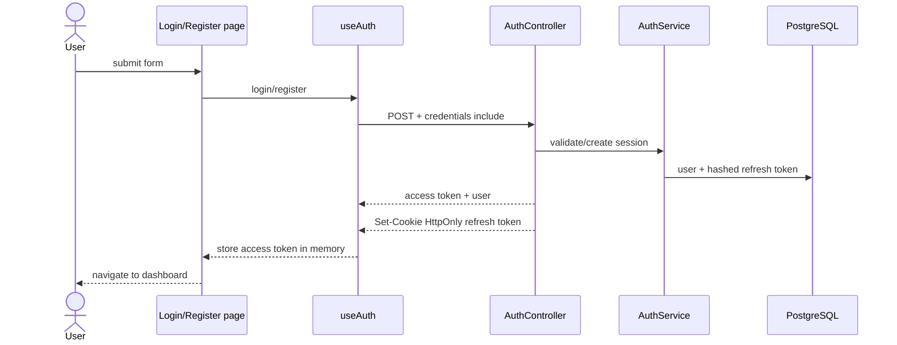

# Workly authentication learning flow

เอกสารนี้อธิบายการเชื่อม Nuxt กับ Auth API ตั้งแต่สมัครสมาชิกจนถึงการกู้ session หลัง reload หน้าเว็บ

## เริ่มระบบในเครื่อง

เปิด terminal สองหน้าต่างจาก root ของ repository:

```powershell
docker compose up -d postgres
dotnet run --project apps/api/src/Workly.Api --launch-profile http
```

```powershell
npm.cmd run dev --workspace apps/web
```

เปิด `http://localhost:3000/register` หรือ `http://localhost:3000/login` ส่วน Swagger อยู่ที่
`http://localhost:5237/swagger/index.html`

## HTTP contract

| Endpoint | Request body | ผลลัพธ์ |
| --- | --- | --- |
| `POST /api/auth/register` | email, password, displayName | access token + user และตั้ง refresh cookie |
| `POST /api/auth/login` | email, password | access token + user และตั้ง refresh cookie |
| `GET /api/auth/me` | ไม่มี | user ปัจจุบัน ต้องมี Bearer token |
| `POST /api/auth/refresh` | ไม่มี | access token ใหม่และหมุน refresh cookie |
| `POST /api/auth/logout` | ไม่มี | revoke session และลบ refresh cookie |

Refresh token ไม่อยู่ใน JSON และ JavaScript อ่านไม่ได้ เพราะ API ใส่ไว้ใน cookie ชื่อ
`workly_refresh` ที่มี `HttpOnly`, `SameSite=Strict` และเปิด `Secure` นอก Development
browser จะส่ง cookie ให้ `/api/auth` อัตโนมัติเมื่อ frontend ใช้ `credentials: 'include'`

Access token เป็น JWT อายุ 15 นาทีและเก็บเฉพาะใน memory ของ Nuxt จึงหายเมื่อ reload
หน้าเว็บ หลัง reload route middleware จะเรียก refresh หนึ่งครั้งเพื่อขอ access token ใหม่จาก cookie

## Flow ของหน้าเว็บ



เมื่อ API อื่นตอบ `401`, `apiFetch` จะให้ทุก request ที่ชนกันรอ refresh promise ตัวเดียว
(single-flight) แล้วลอง request เดิมอีกครั้งเพียงหนึ่งรอบ ถ้า refresh ไม่สำเร็จจะล้าง session

## หน้าที่ของแต่ละไฟล์

### Backend

- `Workly.Application/Auth/AuthContracts.cs` — DTO สาธารณะและ `AuthSession` ภายในที่พก raw refresh token ไปถึง HTTP layer
- `Workly.Api/Controllers/AuthController.cs` — อ่าน/เขียน HttpOnly cookie และคืนเฉพาะ access token กับ user
- `Workly.Infrastructure/Auth/AuthService.cs` — hash password, ออก JWT, hash/rotate/revoke refresh token
- `Workly.Api/Program.cs` — JWT validation, CORS credentials, rate limit, Swagger และ DI

### Frontend

- `app/composables/useAuth.ts` — session state, login/register/logout, refresh single-flight และ authenticated fetch
- `app/middleware/auth.ts` — กันหน้าที่ต้อง login และจำ URL ปลายทางไว้ใน query `redirect`
- `app/middleware/guest.ts` — กันผู้ใช้ที่ login แล้วไม่ให้กลับไปหน้า login/register
- `app/pages/login.vue` และ `register.vue` — form และ error state
- `app/layouts/auth.vue` — layout แยกสำหรับหน้าสมัครและเข้าสู่ระบบ
- `app/types/auth.ts` — TypeScript contract ที่ตรงกับ JSON ของ API
- `app/utils/auth.ts` — แปลง API error, สร้าง initials และป้องกัน open redirect

## แนวคิดความปลอดภัย

- Database เก็บ password ด้วย ASP.NET Core `PasswordHasher` และเก็บ refresh token เป็น SHA-256 hash เท่านั้น
- Refresh token หมุนทุกครั้งที่ใช้ หาก token เก่าถูกนำมา replay ระบบ revoke refresh sessions ของบัญชีนั้น
- Access token ไม่เก็บใน `localStorage` จึงลดโอกาสที่ XSS จะขโมย token ที่คงอยู่ข้ามการ reload
- `safeAuthRedirect` รับเฉพาะ path ภายในที่ขึ้นต้นด้วย `/` แต่ไม่ใช่ `//` เพื่อไม่ให้ login redirect ไปเว็บไซต์อื่น
- Logout revoke refresh session แต่ access token ที่ออกไปแล้วจะใช้ได้จนหมดอายุสูงสุดประมาณ 15 นาที

## Quality checks

```powershell
dotnet build apps/api/Workly.sln
dotnet test apps/api/Workly.sln
npm.cmd run lint --workspace apps/web
npm.cmd run typecheck --workspace apps/web
npm.cmd run test --workspace apps/web
npm.cmd run build --workspace apps/web
npm.cmd run test:e2e --workspace apps/web
```

`apps/api/tests/auth-smoke.ps1` ทดสอบ cookie, rotation, replay, concurrent refresh, expiry,
logout, rate limit และตรวจว่า database ไม่มี raw secrets โดยต้องใช้ฐานข้อมูลทดสอบชั่วคราว

## ขอบเขตงานถัดไป

การสมัครบัญชียังไม่สร้าง Organization หรือ role งาน milestone ถัดไปคือ organization onboarding,
membership authorization และเปลี่ยน dashboard จาก mock data เป็น API จริง
