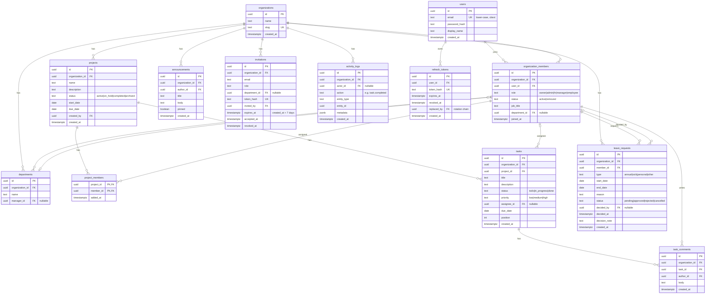

# Workly ERD (Draft v0.1)

สถานะ: **ร่างสำหรับรีวิว** ยังไม่มี migration จริง
ข้อที่ทำเครื่องหมาย `[ตัดสินใจ]` คือการตัดสินใจที่ตกลงกันแล้ว ถ้าเปลี่ยนต้องกลับมาแก้เอกสารนี้

## 1. ข้อตกลงที่ล็อกแล้ว

| # | เรื่อง | ข้อสรุป |
|---|---|---|
| D1 | Owner | `[ตัดสินใจ]` มีได้ **1 คนต่อ org**, โอนสิทธิ์ผ่าน flow เฉพาะ, ห้ามลบ/ลดสิทธิ์ owner ตรง ๆ |
| D2 | Leave approval | `[ตัดสินใจ]` Owner/Admin/HR อนุมัติได้ทุกคน, Manager อนุมัติได้เฉพาะสมาชิกในแผนกที่ตนเป็น manager |
| D3 | Leave balance | `[ตัดสินใจ]` **ไม่มีใน V1** ไม่มีตารางยอดสิทธิ์ลา |
| D4 | Leave type | `[ตัดสินใจ]` enum คงที่: `annual`, `sick`, `personal`, `other` |
| D5 | Department | `[ตัดสินใจ]` 1 member ต่อ 1 แผนก (nullable), `departments.manager_id` ชี้ไปที่ member |
| D6 | Task status | `[ตัดสินใจ]` 3 ขั้น: `todo`, `in_progress`, `done` |
| D7 | Project visibility | `[ตัดสินใจ]` Owner/Admin เห็นทุก project, Manager/Employee เห็นเฉพาะที่เป็น project member, HR ไม่เห็น project โดยอัตโนมัติ |

## 2. Diagram

## 3. เหตุผลของ relationship สำคัญ

- **`users` แยกจาก `organization_members`**: user คือตัวตนที่ login ส่วน member คือ "การเป็นสมาชิกของ org หนึ่ง" role, job title, department จึงอยู่ที่ member ไม่ใช่ user
- **ทุกตารางธุรกิจมี `organization_id`** แม้เข้าถึงได้ผ่าน parent เช่น `tasks` ก็เก็บ `organization_id` ตรง ๆ เพื่อให้ global query filter ของ EF Core กรองได้ทุกตารางโดยไม่ต้อง join
- **`organization_members.status = removed`** แทนการลบแถว เพื่อรักษาประวัติ (task, comment, leave, activity ยังอ้างถึง member นั้นได้)
- **`project_members` เป็น composite PK** `(project_id, member_id)` ไม่ต้องมี id แยก
- **`activity_logs.actor_id` nullable** รองรับ event ของระบบ และใช้ `entity_type` + `entity_id` แบบ polymorphic โดยไม่มี FK (ยอมแลกกับการ query ที่ง่าย เพราะ log ต้องอยู่ได้แม้ entity ถูกลบ)
- **`refresh_tokens.replaced_by`** ใช้ตรวจ token reuse หลัง rotation (ถ้า token เก่าถูกใช้ซ้ำ ให้ revoke ทั้งสาย)

## 4. Constraint และ Index

### สิ่งที่ DB บังคับได้ (บังคับที่ DB)

| ตาราง | Constraint |
|---|---|
| `users` | unique `lower(email)` |
| `organization_members` | unique `(organization_id, user_id)` |
| `organization_members` | **partial unique** `(organization_id) WHERE role = 'owner' AND status = 'active'` (D1) |
| `organizations` | unique `slug` |
| `departments` | unique `(organization_id, lower(name))` |
| `projects` | check `due_date >= start_date` |
| `leave_requests` | check `end_date >= start_date` |
| `invitations` | partial unique `(organization_id, lower(email)) WHERE accepted_at IS NULL AND revoked_at IS NULL` กัน pending ซ้ำ |
| enum ทุกตัว | `CHECK (col IN (...))` |
| ทุก FK ที่ชี้ member/project/task | **composite FK** `(organization_id, id)` เพื่อให้ child กับ parent อยู่ org เดียวกันเสมอ ต้องมี unique `(organization_id, id)` ที่ parent |

> composite FK ข้างบนคือชั้นป้องกัน multi-tenant ที่ระดับ DB ซ้อนกับ query filter ใน EF Core

### สิ่งที่ต้องบังคับใน Service (DB ทำไม่ได้หรือไม่คุ้ม)

- วันลา **ซ้อนกัน** ของ member เดียวกันที่ `pending/approved` ห้ามสร้าง (ทำด้วย exclusion constraint `daterange` ของ Postgres ได้ แต่แนะนำเริ่มที่ service + test ก่อน แล้วพิจารณาเพิ่ม constraint ภายหลัง)
- ใครอนุมัติ leave ได้ (D2) และห้ามอนุมัติของตัวเอง
- ห้ามลบ/ลด role ของ owner, ห้ามลบ member คนสุดท้ายที่เป็น admin ขึ้นไป
- invitation: อีเมลของผู้รับต้องตรงกับ `invitations.email`, ต้องไม่หมดอายุ/ไม่ถูก revoke
- assignee ของ task ต้องเป็น project member
- manager ของ department ต้องเป็น member ของ org เดียวกันและ role อย่างน้อย `manager`

### Index

| ตาราง | Index | ใช้กับ |
|---|---|---|
| `organization_members` | `(user_id)` | org switcher |
| `organization_members` | `(organization_id, department_id)` | Team overview |
| `projects` | `(organization_id, status)` | Active projects |
| `tasks` | `(project_id, status, position)` | Kanban |
| `tasks` | `(organization_id, assignee_id, status)` | My tasks |
| `tasks` | `(organization_id, due_date) WHERE status <> 'done'` | Upcoming |
| `leave_requests` | `(organization_id, start_date, end_date) WHERE status = 'approved'` | On leave today |
| `leave_requests` | `(organization_id, status)` | รายการรออนุมัติ |
| `activity_logs` | `(organization_id, created_at DESC)` | Recent activity |
| `announcements` | `(organization_id, pinned DESC, created_at DESC)` | หน้า announcements |
| `refresh_tokens` | `(user_id)` | revoke ทั้ง user |

## 5. Dashboard map ไปยัง Query

| การ์ด | แหล่งข้อมูล |
|---|---|
| Members | `COUNT(organization_members) WHERE status='active'` |
| Departments | `COUNT(departments)` |
| Active Projects | `projects WHERE status='active'` + progress จาก `tasks` (done / total) |
| On Leave Today | `leave_requests WHERE status='approved' AND today BETWEEN start_date AND end_date` |
| Upcoming | task `due_date` ใน 7 วัน + leave ที่เริ่มใน 7 วัน (union ที่ service ไม่มีตารางของตัวเอง) |
| Task Status | `tasks GROUP BY status` |
| Team Overview | `organization_members GROUP BY department_id` |
| Recent Activity | `activity_logs ORDER BY created_at DESC LIMIT n` |
| Your Tasks (ยังไม่มีใน UI) | `tasks WHERE assignee_id = me AND status <> 'done'` |

## 6. การตัดสินใจเพิ่มเติม

| # | เรื่อง | ข้อสรุป |
|---|---|---|
| D8 | "Your Tasks" บน Dashboard | `[ตัดสินใจ]` เพิ่ม UI **หลัง** ต่อ backend |
| D9 | `projects.status` | `[ตัดสินใจ]` คง `active\|on_hold\|completed\|archived` ไว้เผื่อ ยังไม่ผูกกับ UI |
| D10 | Announcement audience | `[ตัดสินใจ]` ทั้ง org เท่านั้นใน V1 |
| D11 | Primary key | `[ตัดสินใจ]` UUID v7 สร้างที่ฝั่ง app ด้วย `Guid.CreateVersion7()` |
